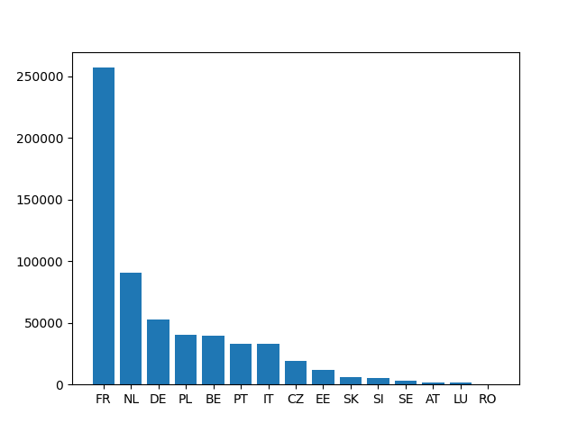
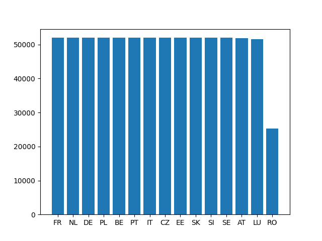
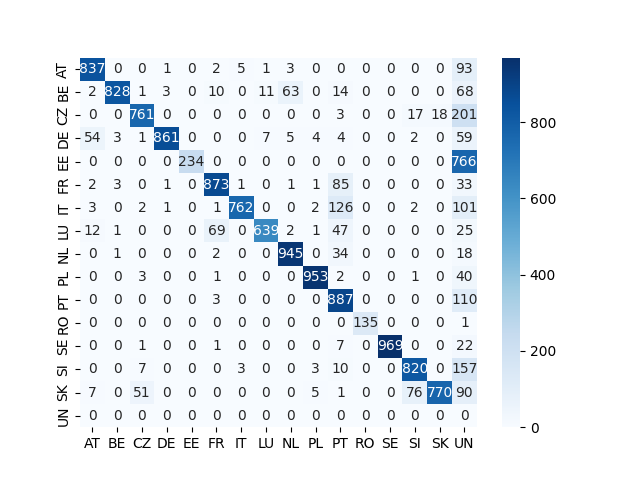
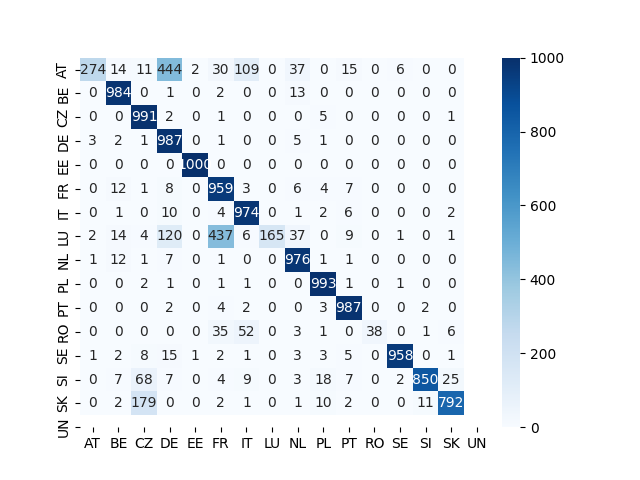
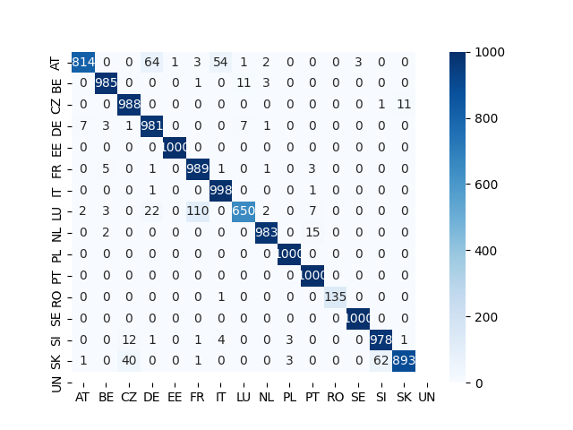

# Address Classification
Build a classifier to identify the country of an address.

## Data

### Data Description
Original dataset from [OpenAddresses](https://batch.openaddresses.io/data).
- Contain addresses and their corresponding countries.
- Contain cities and their corresponding countries.
- The distribution of the number of countries is not balanced.

<div style="text-align: center;">
    
</div>

The number of addresses from Romania is only a few hundred addresses, 
while there are 250,000 addresses from France. I collected more data
from a previous [OpenAddresses](https://results.openaddresses.io/) website
to balance the number of countries.

### Address Generator

A address generator is developed to generate addresses and their corresponding countries
from the collected data. The collected data is in csv format and the following columns are used:
- `NUMBER`
- `STREET`
- `CITY`
- `DISTRICT`
- `REGION`
- `POSTCODE`

Each generated address must contain a city. The other columns are randomly sampled.
There will be a small number of addresses containing the country name at the end of the address.
Detailed implementation refer to the [data_prepare.py](data/data_prepare.py) file.

### Train, Validation, Test Dataset

My goal is to prepare a balanced dataset with the following ideas:
- Train set of 50,000 samples, validation and test set of 1,000 samples respectively.
- Priorly use the original dataset as validation, test set. 
- If data from a country has quite a lot of samples, then use it all for train, validation, and test set.
- If data from a country has less than 2,000 samples, still use all of it for validation and test set and generate data for training set.
- There possibilities that for some countries we can not generate enough data for training set (less than 50,000).

Details refer to the [data_prepare.py](data/data_prepare.py) file. Distribution after this process is shown as below:

<div style="text-align: center;">
    
</div>

## Model

### Rule Based Model
Basicly, the main idea is to find the city in a address and index the city to its country. 
In bit more detail, the model follows the two rules:
1. If the last block is a country, return the country code
2. Iterate through the address blocks and find a complete match with part of the city name,
   there can be multiple matches, so calculate confidence score for each match

The problem for this model falls into the following two categories:
1. Efficiency, it has a O(mn) complexity, where m is the length of the address and n is the length of the city name.
   So as the number of cities increases, the complexity will increase.
2. Accuracy, cities in different countries might have the same name, and part of the address can also be the city name.
   That bring lots of challenges to the model.

The model is implemented in the [rule_model.py](models/rule_model.py) file.

### Statistical Model
The statistical model is a [mMiniLMv2](https://huggingface.co/nreimers/mMiniLMv2-L6-H384-distilled-from-XLMR-Large) model distilled from the XLM-roberta model.
The model is trained on the training set. Details refer to the [stat_model.py](models/stat_model.py) file.

The trained model is saved in the `ckpt` folder and the inference pipeline is defined in the [stat_model.py](models/stat_model.py) file.

The problem for this model are mainly the following:
1. Efficiency, the language model will take quite some time to run

### Combined Model
The combined model is a combination of the statistical and rule based model.

## Deployment

The service is deployed using FastAPI in the [server.py](server.py) file.
A Docker image can also be created using the [Dockerfile](Dockerfile) file.
Some simple tests are defined in the [tester.py](tester.py) file.

## Performances

The performances of models are evaluated using the [evaluator.py](evaluator.py) file on the test set. 
The accuracy and latency of the model are evaluated.
Results shown in the following table.

|          Model          | Accuracy | Latency |
|:-----------------------:|:--------:|:-------:|
|    Rule Based Model     |   0.81   |  20ms   |
| Statistical Model (CPU) |   0.86   |  71ms   |
|     Combined Model      |   0.96   |  95ms   |

Confusion matrix of the rule based model:
<div style="text-align: center;">
    
</div>

Confusion matrix of the statistical based model:
<div style="text-align: center;">
    
</div>

Confusion matrix of the combined based model:
<div style="text-align: center;">
    
</div>

## How to Run

Install the dependencies:
```
pip install -r requirements.txt
```

Configs can be modified in the yaml files in the `config` folder. Notice that for the countries parameters,
only the following countries are supported:
```
['FR', 'DE', 'NL', 'BE', 'PL', 'PT', 'IT', 'CZ', 'EE', 'SK', 'SI', 'SE', 'AT', 'LU', 'RO']
```

After setting up the [train.yaml](configs/train.yaml) file, 
the following command can be used to train the statistical model:
```
python3 models/stat_model.py
```
Both the models can be evaluated offline using the [evaluator.py](evaluator.py) file.
```
python3 evaluator.py
```

After setting up the [service.yaml](configs/service.yaml) file, 
The server can be started using the following command:
```
uvicorn server.server:app --host 0.0.0.0 --port 8080
```

Alternatively, a docker image can be created using the following command:
```
docker build -t address-classification .
docker run -p 8080:8080 -it address-classification
```

The web service can be tested using the [tester.py](tester.py) file:


The service can be accessed by sending a POST request:
```python
import requests
requests.post(f"http://localhost:8080/rule/", json={"address": "burgemeester van de pollstraat 120-h amsterdam"})
```

## Future Work

### Improve the efficiency of the rule based model

The main idea of the model can be regarded as a search problem. 
There are lots of space for improvement, such as: 
- Binary search for the city name in the address
- Use a more efficient data structure to store the city names and their corresponding countries

### Introduce more data or re-split the data carefully for statistical model

From some simple test cases, it seems that the model cannot perform well on the addresses of cities that is
not in the training set:

```python
import requests
requests.post(f"http://localhost:8080/stat/",
              json={"address": "Römerstraße 118, 53117 Bonn"}).json()
>> {'country': 'Austria', 'score': 0.5825262665748596}
```

Solutions include:
1. Find more data covered cities as much as possible in a country
2. Use the generator to generate data of each city in a country,
   avoid putting addresses from a city in both training and evaluation set.


